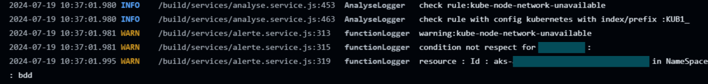
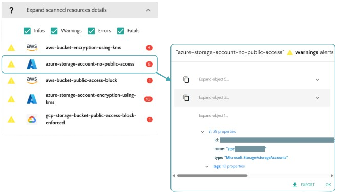
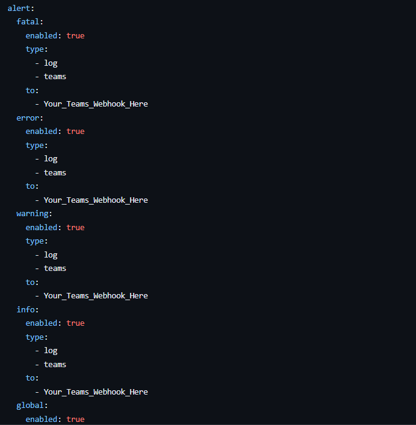

  
# Ready to Run Kexa Action (Open Source)
*This is a repository ready to use for a quick launch of Kexa Github action*

  

<h1>─── Presentation ───</h1>
 

 

Free & Quick scan of your cloud environments for different providers & services   
This will allow you to scan you cloud environment quickly and schedule scans in Git Action.
  

### This can help you ensure :
- ✅ Security
- ✅ Compliance
- ✅ Costs saving
- ✅ Alerting of errors or issues
- ✅ General optimization

All addons are already configured, you juste need to set up the credentials for the one you need. 
If you already set up credentials, go to the next section too see how to run or schedule the scans. 
  

### **How can Kexa Action help you ?**

- ✅ Alerting by Github action logs, MS Teams channel, Email, ... (see section here)
- ✅ Easy-to-run & deploy, no costs
- ✅ Able to export results & data to DB or others services
  

<h2>
You like the idea or are using this project ?   ⭐ Please star us on the core project Kexa : https://github.com/4urcloud/Kexa ⭐
</h2>

<h1>👨‍💻</h1>
<h1>─── How to run ───</h1>

 

## 📦 1. Installation

Simply fork this repository and make it private, or download the content of the repository and make it private
 

❗ Warning : Do not forget to use this repository as a "*private*" repository, you don't want to use Kexa as a public
function because it will display some of your resources ID when raising errors for example.
 

Go into the new repository you just forked or copied.
 
 
 

## 🔧 2. Setting Up Addons

### **Adding credentials for a providers**

Go into "*Settings*", then "*Secrets and variables*", "*Actions*" 
Then you can click and add your credentials, following the instructions
above for the addon you wish to use. 
 

    

    

 
 

### **Required credentials per provider**
*click one to expand and see details*
 

  
Azure

 

  <h3>

  **───────── Azure ─────────** 
  </h3>

 
From your provider, retrieve the following credentials :  

- *AZURECLIENTID*
- *AZURECLIENTSECRET*
- *AZURETENANTID*
- *SUBSCRIPTIONID*

Set each variable in your github repository secret with the prefix "*AZ1_*"
Prefix is defined in "*/config/azure.json*"

So you will have in your github secrets the following variable with the corresponding
credentials as values:

- *AZ1_AZURECLIENTID*
- *AZ1_AZURECLIENTSECRET*
- *AZ1_AZURETENANTID*
- *AZ1_SUBSCRIPTIONID*

**Ready to run for Azure !**
 

  <h3>

  **─────────────────────────────────** 
  </h3>

 

  
Amazon Web Services

 

  <h3>

  **───────── Amazon Web Services ─────────** 
  </h3>

 
  From your provider, retrieve the following credentials :  

- *AWS_ACCESS_KEY_ID*
- *AWS_SECRET_ACCESS_KEY*

Set each variable in your github repository secret with the prefix "*AWS1_*"
Prefix is defined in "*/config/aws.json*"

So you will have in your github secrets the following variable with the corresponding
credentials as values:

- *AWS1_AWS_ACCESS_KEY_ID*
- *AWS1_AWS_SECRET_ACCESS_KEY*

**Ready to run for Amazon Web Services !**
 

  <h3>

  **─────────────────────────────────** 
  </h3>

 

  
Google Cloud Platform

 

  <h3>

  **───────── Google Cloud Platform ─────────** 
  </h3>

 
From your provider, retrieve the following credentials :  

- *GOOGLE_PROJECT_ID*
- *GOOGLE_APPLICATION_CREDENTIALS*

Set each variable in your github repository secret with the prefix "*GCP1_*"
Prefix is defined in "*/config/gcp.json*" and in "*/.github/workflows/gcp.yml*"

So you will have in your github secrets the following variable with the corresponding
credentials as values:

- *GCP1_GOOGLE_PROJECT_ID*
- *GCP1_GOOGLE_APPLICATION_CREDENTIALS*

**Ready to run for Google Cloud Platform !**
 

  <h3>

  **─────────────────────────────────** 
  </h3>

 

  
Kubernetes

 

  <h3>

  **───────── Kubernetes ─────────** 
  </h3>

 
From your provider, retrieve the following credentials :  

- *KUBECONFIG* (content of ".kube/config")

Set each variable in your github repository secret with the prefix "*KUB1_*"
Prefix is defined in "*/config/kube.json*" and in "*/.github/workflows/kube.yml*"

So you will have in your github secrets the following variable with the corresponding
credentials as values:

- *KUB1_KUBECONFIG*

For Kubernetes, you need to pass the content of your ".kube/config" directly in the Github secret value.

**Ready to run for Kubernetes !**
 

  <h3>

  **─────────────────────────────────** 
  </h3>

 

  
HTTP

 

  <h3>

  **───────── HTTP ─────────** 
  </h3>

 

See specific configuration for HTTP : https://github.com/4urcloud/Kexa/blob/main/documentation/provider/HTTP.md

**Ready to run for HTTP !**
 

  <h3>

  **─────────────────────────────────** 
  </h3>

 

  
Github

 

  <h3>

  **───────── Github ─────────** 
  </h3>

 
From your provider, retrieve the following credentials :  

- *GITHUBTOKEN*

Set each variable in your github repository secret with the prefix "*GH1_*"
Prefix is defined in "*/config/git.json*".

So you will have in your github secrets the following variable with the corresponding
credentials as values:

- *GH1_GITHUBTOKEN*

Or else, for the Github addon you can just change the secret name by "GITHUBTOKEN"
instead of the prefix and name. It will take the current permissions on reposiroty.

**Ready to run for Github !**
 

  <h3>

  **─────────────────────────────────** 
  </h3>

 

  
Helm

 

  <h3>

  **───────── Helm ─────────** 
  </h3>

 
From your provider, retrieve the following credentials :  

- *KUBECONFIG* (content of ".kube/config")

Set each variable in your github repository secret with the prefix "*KUB1_*"
Prefix is defined in "*/config/helm.json*" and in "*/.github/workflows/helm.yml*"

So you will have in your github secrets the following variable with the corresponding
credentials as values:

- *KUB1_KUBECONFIG*

For Helm, you need to pass the content of your ".kube/config" directly in the Github secret value.

**Ready to run for Helm !**
 

  <h3>

  **─────────────────────────────────** 
  </h3>

 

  
Office 365

 

  <h3>

  **───────── Office 365 ─────────** 
  </h3>

 
  
* tuto here *

 

  <h3>

  **─────────────────────────────────** 
  </h3>

 

 
 
 

## ⏰ 3. Running & Scheduling

  

<h3>

**Option 1 : Manual trigger (for testing or one shot scan)**

</h3>

 

Every addon has its associated workflow. (example : for Azure there is azure.yml, AWS there is aws.yml)  
Each addon workflow has a manual trigger, if you want to directly schedule the scan with a date/time or interval,
please keep reading to the next section 'Scheduled Trigger'. 
 
For manual trigger, go to "*Actions*" in your repository, and select the workflow from the addon
you wish to trigger : 
 

    

  
Then you can click on "run workflow", and then click on "run workflow" again from the pop-up window.
  

    

  
By triggering the manual option, you can check that your credentials are correct once you've defined them in the Github repository.

  

<h3>

**Option 2 : Scheduled trigger**

</h3>

 

Tnere is a global workflow to trigger and schedule all addons at once named "kexa.yml" 
This one is just a trigger to call all other workflows. 
 
It is defined in the "kexa.yml" as a cronjob, to know more about how to use and define cronjob, you can refer to this documentation :   https://pubs.opengroup.org/onlinepubs/9699919799/utilities/crontab.html#tag_20_25_07  
 
By default, it will trigger every addons every day at 12:00pm. 
To change this, open "/.github/workflows/kexa.yml" and change the cronjob as you wish 
 

    

 

You can also use services like https://crontab.guru/ or https://crontab-generator.org/ that will help you write the cronjob you need.

 
 
 

## 🎯 4. Expected Results

 
By default, the "*log*" option is activated, so you will have your results in your
Github action logs.
 
 
This section will show you a few example of expected results with explanations.
 
If you want to use another notification channel than "*log*", refer to the next section.
 
 

### Github Action Logs

 
Using this github action, you can simply check the logs by going in 'Actions' and clicking on the associated workflow 'Azure Kexa Action'.
 
You will see the list of alerts with the level, resources ID and rule name and description.
  

    

 

### Microsoft Teams

 
By setting up 'teams' notifications, you will get a team card in the channel where you set up the webhook. 
To configure this, refer to the next section.
 
This card will resume the scan results, with all rules that raised an error, with associated resources ID and important informations for remediation.
  

    

 

### Kexa SAAS (no public release yet)

 
SaaS has been developed but is not yet available, it will allow you to visualize your results and resources, having an history of your previous scan with statistics,
browse a rules catalog, use the rule editor.
 
If this interest you, please contact us at contact@4urcloud.eu
  

    

 
 
 

## 🛠️ 5. More configuration options

 

### Teams notifications

To enable teams notification, open the rule file you want to be notified of. 
For example, in this repository, the Azure addon is using the "/rules/azureSetRules.yaml" file to scan. 
 
Open this file and in the notification section (at the top-level of the file), add "teams" value in the "type" field.
And add your teams channel webhook in the corresponding "to" field
 
To get your teams channel webhook : https://learn.microsoft.com/en-us/microsoftteams/platform/webhooks-and-connectors/how-to/add-incoming-webhook?tabs=newteams%2Cdotnet
 
You can now set this configuration for each level alert in this file, (you can just set it in the global if you just want global notification).
  

    

  
That's it you're ready to get notified !
 
 

### More channels

Kexa git action is based on the core project Kexa : https://github.com/4urcloud/Kexa/
This is just a quick launch repository, but below there is some additionals configuration you can set
without having to read the Kexa core documentation.

To have more advanced options and editing tutorial, refer to the core project documentation.

 

##### Enabling / Disabling rules, Editing & Error levels

##### Specifying alert channels

You can visualize the results of a scan in the Github workflow logs, but Kexa as a lot more to offer, with different notifications channels such as :

- [x] Email
- [x] Microsoft Teams
- [x] SMS
- [x] Webhook
- [] Jira

Naturally, you'll get a structured, easy-to-read set of results, with as much precision as logs, but less text data.

To know more about how to use those channels : 

##### Using multiple subscriptions/projects for a provider

<h1>─── Going further with Kexa ───</h1>
 

 

This repository is a easy to launch demo of the Kexa script running in Github action, to refer to the core project and the full documentation, follow this link : https://github.com/4urcloud/Kexa

<h1>─── Kexa Git action is currently available for ───</h1>
 

 

- ✅ Azure
- ✅ Amazon Web Services
- ✅ Google Cloud Platform
- ✅ Kubernetes
- ✅ Github
- ✅ Helm
- ✅ Office 365
- ☐ Google Workspace (in re-work for git action)
  
  
