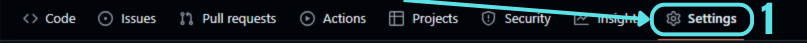
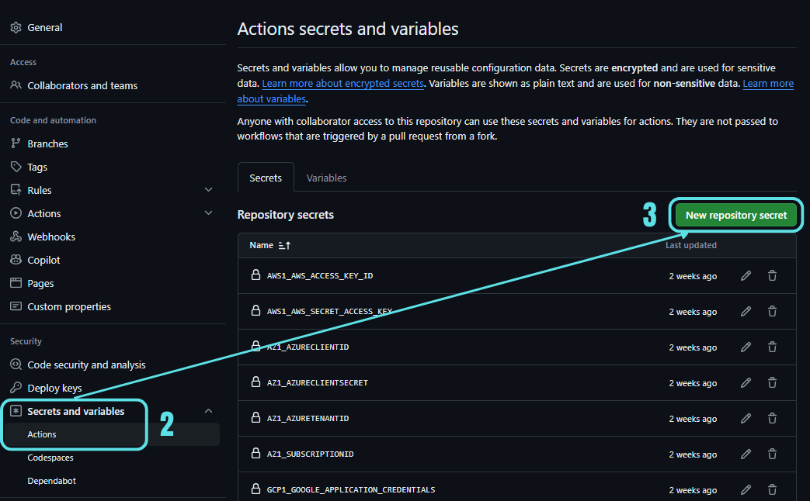
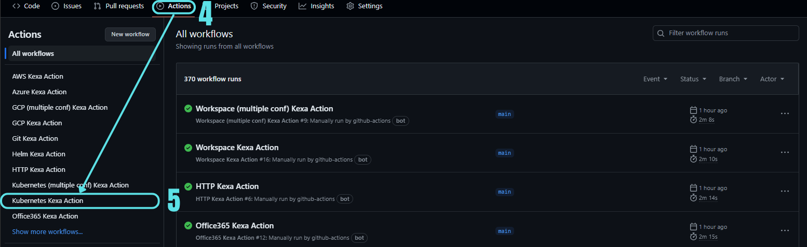
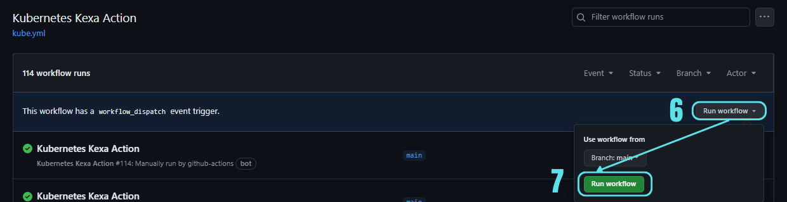
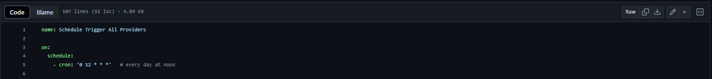

# Ready to Run Kexa Action (Open Source)

  

<h1>─── Presentation ───</h1>
 

 

**🚀 This is a repository ready to use for Kexa Github action.**
This will allow you to scan you cloud environment quickly and schedule scans in Git Action.
  

### This can help you ensure :
- ✅ Security
- ✅ Compliance
- ✅ Costs saving
- ✅ Alerting of errors or issues
- ✅ General optimization

All addons are already configured, you juste need to set up the credentials for the one you need. 
If you already set up credentials, go to the next section too see how to run or schedule the scans. 
  

### **How can Kexa Action help you ?**

- ✅ Alerting by Github action logs, MS Teams channel, Email, ... (see section here)
- ✅ Easy-to-run & deploy, no costs
- ✅ Able to export results & data to DB or others services
  

<h2>
You like the idea or are using this project ? ⤵️   ⭐ Please star us on the core project Kexa : https://github.com/4urcloud/Kexa ⭐
</h2>
 

<h1>─── How to run ───</h1>

 

## 📦 1. Installation

Simply fork this repository and make it private, or download the content of the repository and make it private
 
* Warning * Do not forget to use this repository as a "*private*" repository, you don't want to use Kexa as a public
function because it will display some of your resources ID when raising errors for example.
 

Go into the new repository you just forked or copied.
 
 

## 🔧 2. Setting Up Addons

Go into "*Settings*", then "*Secrets and variables*", "*Actions*" 
Then you can click and add your credentials, following the instructions
above for the addon you wish to use. 

    

    

 
 

  
Azure

  
From your provider, retrieve the following credentials :

- AZURECLIENTID
- AZURECLIENTSECRET
- AZURETENANTID
- SUBSCRIPTIONID

Set each variable in your github repository secret with the prefix "AZ1_"
Prefix is defined in "/config/azure.json"

So you will have :

- AZ1_AZURECLIENTID
- AZ1_AZURECLIENTSECRET
- AZ1_AZURETENANTID
- AZ1_SUBSCRIPTIONID

Ready to run for Azure !

  
Amazon Web Services

  From your provider, retrieve the following credentials :

- AWS_ACCESS_KEY_ID
- AWS_SECRET_ACCESS_KEY

Set each variable in your github repository secret with the prefix "AWS1_"
Prefix is defined in "/config/aws.json"

So you will have :

- AWS1_AWS_ACCESS_KEY_ID
- AWS1_AWS_SECRET_ACCESS_KEY

Ready to run for Amazon Web Services !

  
Google Cloud Platform

From your provider, retrieve the following credentials :

- GOOGLE_PROJECT_ID
- GOOGLE_APPLICATION_CREDENTIALS

Set each variable in your github repository secret with the prefix "GCP1_"
Prefix is defined in "/config/gcp.json" and in "/.github/workflows/gcp.yml"

So you will have :

- GCP1_GOOGLE_PROJECT_ID
- GCP1_GOOGLE_APPLICATION_CREDENTIALS

Ready to run for Google Cloud Platform !

  
Kubernetes

From your provider, retrieve the following credentials :

- KUBECONFIG

Set each variable in your github repository secret with the prefix "KUB1_"
Prefix is defined in "/config/kube.json" and in "/.github/workflows/kube.yml"

So you will have :

- KUB1_KUBECONFIG

Ready to run for Kubernetes !

  
Github

* tuto here *

  
Helm

  
* tuto here *

  
Office 365

  
* tuto here *

 
 

## ⏰ 3. Running & Scheduling

  

<h3>

**Manual trigger (for testing or one shot scan)**

</h3>

 

Every addon has its associated workflow. (example : for Azure there is azure.yml, AWS there is aws.yml)  
Each addon workflow has a manual trigger, if you want to directly schedule the scan with a date/time or interval,
please keep reading to the next section 'Scheduled Trigger'. 
 
For manual trigger, go to "*Actions*" in your repository, and select the workflow from the addon
you wish to trigger : 

    

  
Then you can click on "run workflow", and then click on "run workflow" again from the pop-up window.
  

    

  
By triggering the manual option, you can check that your credentials are correct once you've defined them in the Github repository.

  

<h3>

**Scheduled trigger**

</h3>

 

Tnere is a global workflow to trigger and schedule all addons at once named "kexa.yml" 
This one is just a trigger to call all other workflows. 
 
It is defined in the "kexa.yml" as a cronjob, to know more about how to use and define cronjob, you can refer to this documentation :   https://pubs.opengroup.org/onlinepubs/9699919799/utilities/crontab.html#tag_20_25_07  
 
By default, it will trigger every addons every day at 12:00pm. 
To change this, open "/.github/workflows/kexa.yml" and change the cronjob as you wish 
 

    

You can also use services like https://crontab.guru/ or https://crontab-generator.org/ that will help you write the cronjob you need.

 

## 🎯 4. Expected Results

 

## 🛠️ 5. More configuration options

Kexa git action is based on the core project Kexa : https://github.com/4urcloud/Kexa/
This is just a quick launch repository, but below there is some additionals configuration you can set
without having to read the Kexa core documentation.

To have more advanced options and editing tutorial, refer to the core project documentation.

 

##### Enabling / Disabling rules, Editing & Error levels

##### Specifying alert channels

You can visualize the results of a scan in the Github workflow logs, but Kexa as a lot more to offer, with different notifications channels such as :

- [x] Email
- [x] Microsoft Teams
- [x] SMS
- [x] Webhook
- [] Jira

Naturally, you'll get a structured, easy-to-read set of results, with as much precision as logs, but less text data.

To know more about how to use those channels : 

##### Using multiple subscriptions/projects for a provider

<h1>─── Going further with Kexa ───</h1>
 

 

This repository is a easy to launch demo of the Kexa script running in Github action, to refer to the core project and the full documentation, follow this link : https://github.com/4urcloud/Kexa

<h1>─── Kexa Git action is currently available for ───</h1>
 

 

- ✅ Azure
- ✅ Amazon Web Services
- ✅ Google Cloud Platform
- ✅ Kubernetes
- ✅ Github
- ✅ Helm
- ✅ Office 365
- ☐ Google Workspace (in re-work for git action)
  
  
